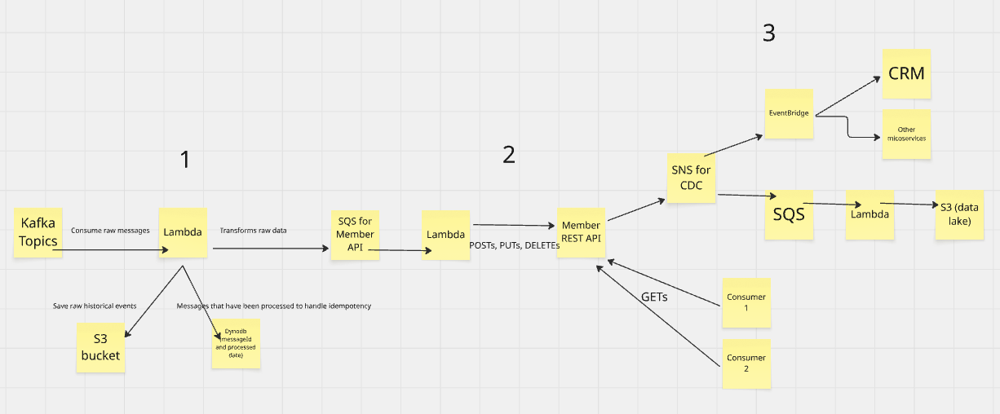

# Take Home Scenario
## Diagram

## Summary

### Section 1
A lambda function will be a subscriber of a Kafka topic of member related changes. This lambda will be responsible of consuming the raw messages, storing these messages in an S3 bucket, and transforming this messages to be put on the SQS queue down stream for eventually the Member API to consume. A DynamoDB table will be used to keep track of the message ids and when each message was processed to help with ensure that each message is processed once. 

### Section 2
A lambda function will poll the SQS queue for updates that came upstream for member related changes. This lambda will have logic to update (put, post, delete) the Member API. This Member API will be used to interface the data to the rest of the organization. When there is a successful update on the Member API, a message will be published on the SNS topic to fan out the changes to downstream consumers. 

### Section 3
There will be subscribers to the SNS topics to get the changes from the Member API. EventBridge will be a target and this will be used to fan out changes to other systems such as CRM, or other AWS microservices on other accounts. SQS with a lambda can be used to get the messages from the SNS topics into an S3 bucket; which could be used as a data lake (or get into another data product such as Snowflake). Consumers that depend Member data, but not necessarily need it near real time, will be able to call the Member API with `GET /member/{id}`

## Assumptions
* All services will have IAM permissions with the least privilege necessary to support this flow. All sensitive data will be encrypted at rest. The API will use OAuth bearer tokens to handle authorization and authentication and keep client secrets encrypted in a service such as AWS Secret Manager. 
* If needed, our lambdas can have exponential back off logic to retry errors when dependencies fail. Otherwise, dead letter queues will be used to handle message processing failures or if a message fails to deliver to their target.
* Cloudwatch metrics and log groups will be used to support observability. Cloudwatch metrics can be used to trigger on call alerts, Team alerts, emails, etc. on failures.
* Use AWS FIFO SNS and SQS support if ordering matters. If idempotency matters, then a DynamoDB table might be needed next to each SQS queue to help with replaying messages. 

## Design choices and considerations
* Member API design summary
  * Deploy the database using AWS RDS so we don't need to manage a container. This can be PostgreSQL, Aurora, MySQL -- it will depend on Wellmark's preference in a relational database. 
  * The API will be hosted using ECS and Fargate. This will help with scaling in the future. I will acknowledge that API Gateway + Lambdas could be an option here. I'm not too terribly familiar with using API Gateway; if this was a formal proposal with more time, I would experiment with this route as well to see if it would fit our needs. 
* Using the API as a way to fan out changes downstream
  * Inserting the transformed data directly into the transactional database that backs the Member API is definitely an option. On the surface, this might be the most straight forward path to achieve the goal. In this case, the only entry point to create member changes would be through the CoreSystem or the Kafka topics. I think being able to decouple the API and the rest of the downstream from CoreSystem/Kafka topics would give us more flexibility in the future when there will inevitably be a need to get member changes into the system outside of CoreSystem.
* Possibly use AWS Step Functions
  * I am not too terribly familiar with step functions. But as I was researching a few things to complete this assignment, I came across how Step Functions could potential help us orchestrate the flow of a few lambdas in the diagram (especially the 1st lambda)